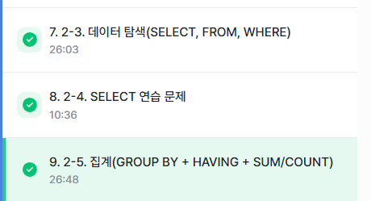
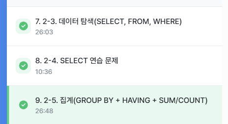

# SQL_BASIC 3주차 정규 과제 

📌SQL_BASIC 정규과제는 매주 정해진 분량의 `초보자를 위한 BigQuery(SQL) 입문` 강의를 듣고 간단한 문제를 풀면서 학습하는 것입니다. 이번주는 아래의 **SQL_Basic_3rd_TIL**에 나열된 분량을 수강하고 `학습 목표`에 맞게 공부하시면 됩니다.

**3주차 과제는 문제 풀이를 중심으로**, 강의에서 제시된 예제 문제 중 **7 문제 이상을 선택하여 직접 풀어본 뒤**, 강의 영상의 풀이와 비교해 **틀린 부분, 맞은 부분, 새롭게 배운 개념**을 구체적으로 정리해주세요. (적어도 3문제는 정리해야 합니다.) 완성된 과제는 Gihub에 업로드하고, 링크를 스프레드시트 'SQL' 시트에 입력해 제출해주세요.

**👀(수행 인증샷은 필수입니다.)** 

## SQL_BASIC_3rd

### 섹션 3. 데이터 탐색 - 조건, 추출, 요약

### 2-6. 연습문제 1~3번

### 2-6. 연습문제 7~9번

### 2-6. 연습문제 10~12번

### 2-6. 연습문제 13~17번

### 2-7. 정리 

### 2-8. 새로운 집계함수


## 섹션 4. 쿼리 잘 작성하기, 쿼리 작성 템플릿 및 오류를 잘 디버깅하기

### 3-1. INTRO

### 3-2. SQL 쿼리 작성하는 흐름

### 3-3. 쿼리 작성 템플릿과 생산성 도구 


## 🏁 강의 수강 (Study Schedule)

| 주차  | 공부 범위              | 완료 여부 |
| ----- | ---------------------- | --------- |
| 1주차 | 섹션 **1-1** ~ **2-2** | ✅         |
| 2주차 | 섹션 **2-3** ~ **2-5** | ✅         |
| 3주차 | 섹션 **2-6** ~ **3-3** | ✅         |
| 4주차 | 섹션 **3-4** ~ **4-4** | 🍽️         |
| 5주차 | 섹션 **4-4** ~ **4-9** | 🍽️         |
| 6주차 | 섹션 **5-1** ~ **5-7** | 🍽️         |
| 7주차 | 섹션 **6-1** ~ **6-6** | 🍽️         |

<br>

<!-- 여기까진 그대로 둬 주세요-->

---

# 1️⃣ 개념정리

## 2-6. 연습문제

~~~
✅ 학습 목표 :
* 연습문제(7문제 이상) 푼 것들 정리하기
~~~

### 문제1.
```
Q. 포켓몬 중에 type2가 없는 포켓몬의 수를 작성하는 쿼리를 작성해주세요
```
$\rightarrow$ 어떤 컬럼 : 따로 없음. 포켓몬의 수만 남기면 됨  

```sql
SELECT 
 COUNT(id) AS cnt
FROM basic.pokemon
WHERE
 type2 is null
```
$\rightarrow$ `WHRERE` 절에서 여러 조건을 연결하고 싶은 경우, `AND` 사용  
$\rightarrow$ `OR` 조건 : 선택

### 문제2. 
```
Q. type2가 없는 포켓몬의 type1과 type1의 포켓몬의 수를 알려주는 쿼리를 작성해주세요. 단, type1의 포켓몬 수가 큰 순으로 정렬해주세요.
```
정렬 : `ORDER BY` , 큰 순으로 = 내림차순(`DESC`)

```SQL

SELECT 
 type1,
 -- 빨간 밑줄은 에러
 COUNT(id) AS cnt
 -- 집계 함수는 GROUP BY 랑 같이 다님, 집계하는 기준(컬럼)이 없으면 COUNT 만 쓸 수 있으나, 기준이 있으면 같이 써줘야 함
FROM basic.pokemon
WHERE
 type2 is null
GROUP BY
 type1
ORDER BY
 cnt DESC
```

### 문제3.
```
Q. type2 와 상관없이 type1의 포켓몬 수를 알 수 있는 쿼리를 작성해주세요.
```
```sql
SELECT 
 type1,
 COUNT(id) AS cnt
 -- COUNT(DISTINCT id) AS cnt
 -- DISTINCT 언제 쓸까? 고유한 값만 보고싶을 때 사용. Unique 한 값만 보고싶은 경우 사용.
FROM basic.pokemon
GROUP BY
 type1
```


### 문제4.
```
Q. 전설 여부에 따른 포켓몬 수를 알 수 있는 쿼리를 작성해주세요.
```

```SQL
SELECT 
 is_legendary,
 COUNT(id) AS cnt
FROM basic.pokemon
GROUP BY
 is_legendary
-- GROUP BY 1 => SELECT 의 첫 컬럼을 의미
```

### 문제5.

```
Q. 동명 이인이 있는 이름은 무엇일까요?
```


```SQL
SELECT
  name,
  count(name) as trainer_cnt
FROM basic.trainer
GROUP BY
  name
-- 집계 후 조건은 having
HAVING
  trainer_cnt >= 2
```
`서브쿼리`: 쿼리문을 한번 감싸서 다른 쿼리문에서 사용할 수 있음

### 문제6.

```
Q. trainer 테이블에서 "Iris" 트레이너 정보를 알 수 있는 쿼리를 작성해주세요.
```

```SQL
SELECT
  *
FROM basic.trainer
WHERE name = "Iris"

```

### 문제7.

```
Q. trainer 테이블에서 "Iris", "Whitney", "Cynthia" 트레이너의 정보를 알 수 있는 쿼리를 작성해주세요
```

```SQL
SELECT
  *
FROM basic.trainer
WHERE 
 name in ("Iris", "Whitney", "Cynthia")
```

### 문제8.

```
Q. 전체 포켓몬 수는 얼마나 되나요?
```

```SQL
SELECT
  count(id) AS pokemon_cnt
FROM basic.pokemon
```


### 문제9.

```
Q. 세대(generation) 별로 포켓몬 수가 얼마나 되는지 알 수 있는 쿼리를 작성해주세요.
```

```SQL
SELECT
 generation,
 count(id) AS pokemon_cnt
FROM basic.pokemon
GROUP BY generation
```


### 문제10.

```
Q. type2가 존재하는 포켓몬의 수가 얼마나 되나요?
```

```SQL
SELECT
 count(id) AS pokemon_cnt
FROM basic.pokemon
WHERE 
 type2 is not null
```

### 문제11.

```
Q. type2가 있는 포켓몬 중에 제일 많은 type1은 무엇인가요? 
```

```SQL
SELECT
 type1,
 count(id) AS pokemon_cnt
FROM basic.pokemon
WHERE 
 type2 is not null
GROUP BY type1 
ORDER BY pokemon_cnt DESC
LIMIT 1
```


### 문제12.

```
Q. 단일(하나의 타입만 있는) 타입 포켓몬 중 많은 type1 은 무엇일까요?
```

```SQL
SELECT
 type1,
 count(id) AS pokemon_cnt
FROM basic.pokemon
WHERE 
 type2 is null
 OR type1 is null
GROUP BY type1 
ORDER BY pokemon_cnt DESC
limit 1
```


### 문제13.

```
Q. 포켓몬의 이름에 "파"가 들어가는 포켓몬은 어떤 포켓몬이 있을까요?
```

```SQL
SELECT
 kor_name
FROM basic.pokemon
WHERE 
 kor_name like "파%"
  -- %파$ : '파'가 들어간 단어
```

### 문제14.

```
Q. 뱃지가 6개 이상인 트레이너는 몇 명이 있나요?
```

```SQL
SELECT
 count(name) AS trainer_cnt
FROM basic.trainer
WHERE 
 badge_count >= 6

```

### 문제15.

```
Q. 트레이너가 보유한 포켓몬(trainer_pokemon)이 제일 많은 트레이너는 누구일까요? 
```

```SQL
SELECT 
  trainer_id,
  COUNT(pokemon_id) as cnt_pokemon
FROM basic.trainer_pokemon
GROUP BY trainer_id
ORDER BY cnt_pokemon DESC
LIMIT 1
```

### 문제16.

```
Q. 포켓몬을 많이 풀어준 트레이너는 누구일까요?
```

```SQL
SELECT 
  trainer_id,
  COUNT(pokemon_id) as pokemon_cnt
FROM basic.trainer_pokemon
WHERE status = "Released"
GROUP BY trainer_id
ORDER BY pokemon_cnt DESC
LIMIT 1
```

### 문제17.

```
Q. 트레이너 별로 풀어준 포켓몬의 비율이 20%가 넘는 포켓몬 트레이너는 누구일까요? *풀어준 포켓몬의 비율 = (풀어준 포켓몬 수/전체 포켓몬의 수)
```

```SQL
select 
  trainer_id,
  countif(status = 'Released'), -- 풀어준 포켓몬 수
  count(pokemon_id) as pokemon_cnt,
  countif(status = 'Released') / count(pokemon_id) as released_ratio
from basic.trainer_pokemon
group by 
  trainer_id
having
  released_ratio >= 0.2
```


## 2-8. 새로운 집계함수

~~~
✅ 학습 목표 :
* SQL 쿼리 구조를 이해할 수 있다. 
* SELECT, FROM, WHERE을 활용하는 방법을 설명할 수 있다. 
~~~

**`GROUB BY ALL`**  
: `SELECT` 절에 있는 컬럼들을 `GROUP BY` 뒤에 일일이 다 적을 필요 없음


## 3-2. 쿼리를 작성하는 흐름

~~~
✅ 학습 목표 :
* 쿼리를 작성하는 흐름을 설명할 수 있다.
~~~

|  |  |  |
|:----:|------|------|
| 1 | 지표 고민 | 어떤 데이터가 문제를 해결하기 위해 필요한가? |
| 2 | 지표 구체화 | 추상적이지 않고 구체적인 지표 명시 (분자, 분모 표시) |
| 3 | 지표 탐색 | 유사한 문제를 해결한 케이스가 있나 확인 $\rightarrow$ 존재 $\rightarrow$ 해당 쿼리 리뷰 |
| 4 | 쿼리 작성 | 데이터가 있는 테이블 찾기 (1개면 바로 활용, 2개 이상이면 연결 방법 고민(JOIN)) |
| 5 | 데이터 정한성 확인 | 예상한 결과와 동일한지 확인 |
| 6 | 쿼리 가독성 | 나중을 위해 깔끔하게 쿼리 작성 |
| 7 | 쿼리 저장 | 쿼리는 재사용되므로 문서로 저장 |


## 3-3. 쿼리 작성 템플릿과 생산성 도구

~~~
✅ 학습 목표 :
* 생산성 도구를 만들 수 있다.
~~~

### 쿼리 작성 템플릿
```SQL
# 쿼리를 작성하는 목표, 확인할 지표:
# 쿼리 계산 방법:
# 데이터의 기간:
# 사용할 테이블:s
# Join KEY:
# 데이터 특징:

SELECT

FROM
WHERE
```

### 생산성 도구
**Espanso**  
핵심 로직:특정 단어 감지되면 정의된 것으로 바꾼다!  


<br>
<br>

---

# 2️⃣ 학습 인증란




<br><br>


---

# 3️⃣ 확인문제

## 문제 1

> **🧚Q. Q. 포켓몬 연구에 흥미를 느낀 혜인은 각 타입(type1)별 평균 공격력(attack)을 비교해보고 싶었습니다.**
>
> 그래서 다음과 같은 필요한 정보를 미리 정리해보았습니다. 

~~~
조건 : attack이 50 이상인 포켓몬만 포함
보고 싶은 컬럼 : type1
집계 내용 : 각 type1 별 평균 공격력
정렬 기준 : 평균 공격력을 기준으로 내림차순 정렬
~~~

> **이 목표를 바탕으로 혜인은 아래와 같은 쿼리를 작성했지만, 일부 SQL 문법 요소를 빼먹었습니다. 비어 있는 부분인 ㄱ, ㄴ, ㄷ, ㄹ 에 들어갈 알맞은 SQL 구문을 채워보세요:**

~~~sql
SELECT type1, (ㄱ)
FROM pokemon
(ㄴ) attack >= 50
(ㄷ) type1
ORDER BY (ㄱ) (ㄹ);
~~~


~~~
ㄱ. attack
ㄴ. WHERE
ㄷ. GROUP BY
ㄹ. DESC
~~~


### 🎉 수고하셨습니다.0